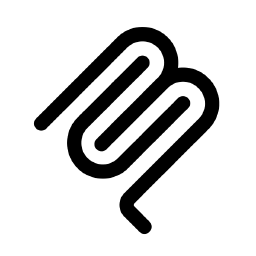
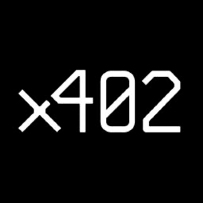
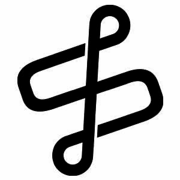
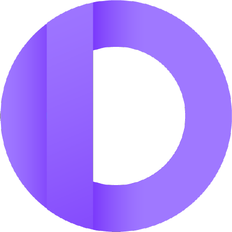
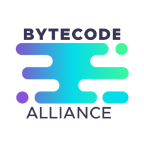
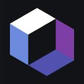
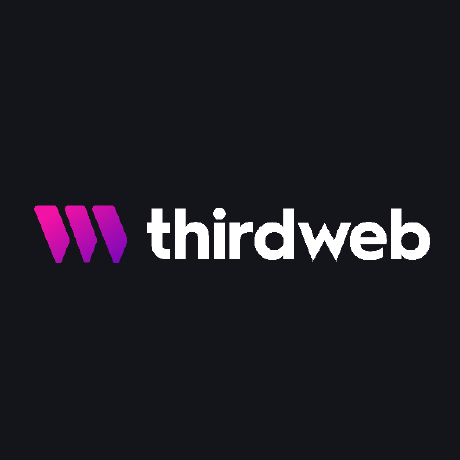
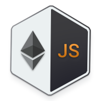
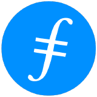
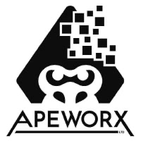

# Merged OSS contributions

Open-source projects [SashaMIT](https://github.com/SashaMIT) (CEO / Founder, [Elacity](https://ela.city)) has contributed to.

Merged only. Detail lives on each PR.

<table>
  <thead>
    <tr>
      <th>Project</th>
      <th>Merged PRs</th>
    </tr>
  </thead>
  <tbody>
    <tr>
      <td valign="middle">
        
        <strong><a href="https://github.com/langflow-ai/langflow">langflow-ai/langflow</a></strong> 
        Visual framework for building AI agents and MCP workflows
      </td>
      <td valign="middle">
        <a href="https://github.com/langflow-ai/langflow/pull/14474">#14474</a>
      </td>
    </tr>
    <tr>
      <td valign="middle">
        
        <strong><a href="https://github.com/modelcontextprotocol/registry">modelcontextprotocol/registry</a></strong> 
        Official registry for MCP servers
      </td>
      <td valign="middle">
        <a href="https://github.com/modelcontextprotocol/registry/pull/1506">#1506</a>
      </td>
    </tr>
    <tr>
      <td valign="middle">
        
        <strong><a href="https://github.com/x402-foundation/x402">x402-foundation/x402</a></strong> 
        Internet-native payment protocol for APIs/agents
      </td>
      <td valign="middle">
        <a href="https://github.com/x402-foundation/x402/pull/3034">#3034</a> ·
        <a href="https://github.com/x402-foundation/x402/pull/3033">#3033</a> ·
        <a href="https://github.com/x402-foundation/x402/pull/3032">#3032</a>
      </td>
    </tr>
    <tr>
      <td valign="middle">
        
        <strong><a href="https://github.com/elizaOS/eliza">elizaOS/eliza</a></strong> 
        AI agent framework
      </td>
      <td valign="middle">
        <a href="https://github.com/elizaOS/eliza/pull/18009">#18009</a> ·
        <a href="https://github.com/elizaOS/eliza/pull/18003">#18003</a> ·
        <a href="https://github.com/elizaOS/eliza/pull/18006">#18006</a> ·
        <a href="https://github.com/elizaOS/eliza/pull/17978">#17978</a> 
        <a href="https://github.com/elizaOS/eliza/pull/17775">#17775</a> ·
        <a href="https://github.com/elizaOS/eliza/pull/17773">#17773</a> ·
        <a href="https://github.com/elizaOS/eliza/pull/17748">#17748</a>
      </td>
    </tr>
    <tr>
      <td valign="middle">
        
        <strong><a href="https://github.com/cloudflare/web-bot-auth">cloudflare/web-bot-auth</a></strong> 
        HTTP message signatures for authenticating bots and agents
      </td>
      <td valign="middle">
        <a href="https://github.com/cloudflare/web-bot-auth/pull/125">#125</a> ·
        <a href="https://github.com/cloudflare/web-bot-auth/pull/127">#127</a>
      </td>
    </tr>
    <tr>
      <td valign="middle">
        
        <strong><a href="https://github.com/foundry-rs/foundry">foundry-rs/foundry</a></strong> 
        Ethereum development toolkit (Forge, Cast, Anvil)
      </td>
      <td valign="middle">
        <a href="https://github.com/foundry-rs/foundry/pull/16096">#16096</a> ·
        <a href="https://github.com/foundry-rs/foundry/pull/16237">#16237</a>
      </td>
    </tr>
    <tr>
      <td valign="middle">
        
        <strong><a href="https://github.com/coinbase/cb-mpc">coinbase/cb-mpc</a></strong> 
        Coinbase MPC signing library
      </td>
      <td valign="middle">
        <a href="https://github.com/coinbase/cb-mpc/pull/131">#131</a>
        (credit for <a href="https://github.com/coinbase/cb-mpc/pull/129">#129</a>)
      </td>
    </tr>
    <tr>
      <td valign="middle">
        
        <strong><a href="https://github.com/solana-program">solana-program</a></strong> 
        Official Solana on-chain program libraries
      </td>
      <td valign="middle">
        <a href="https://github.com/solana-program/token/pull/168">token#168</a> ·
        <a href="https://github.com/solana-program/token-2022/pull/1365">token-2022#1365</a> 
        <a href="https://github.com/solana-program/token-metadata/pull/111">metadata#111</a> ·
        <a href="https://github.com/solana-program/token-group/pull/117">group#117</a> 
        <a href="https://github.com/solana-program/stake-pool/pull/846">stake-pool#846</a> ·
        <a href="https://github.com/solana-program/zk-elgamal-proof/pull/505">zk#505</a> 
        <a href="https://github.com/solana-program/associated-token-account/pull/293">ATA#293</a> ·
        <a href="https://github.com/solana-program/address-lookup-table/pull/346">ALT#346</a> 
        <a href="https://github.com/solana-program/system/pull/89">system#89</a> ·
        <a href="https://github.com/solana-program/record/pull/363">record#363</a> 
        <a href="https://github.com/solana-program/compute-budget/pull/37">compute#37</a> ·
        <a href="https://github.com/solana-program/feature-gate/pull/83">feature#83</a>
      </td>
    </tr>
    <tr>
      <td valign="middle">
        
        <strong><a href="https://github.com/anza-xyz/agave">anza-xyz/agave</a></strong> 
        Solana validator client (Agave)
      </td>
      <td valign="middle">
        <a href="https://github.com/anza-xyz/agave/pull/14336">#14336</a>
      </td>
    </tr>
    <tr>
      <td valign="middle">
        
        <strong><a href="https://github.com/livekit/protocol">livekit/protocol</a></strong> 
        Real-time audio/video platform core protocol
      </td>
      <td valign="middle">
        <a href="https://github.com/livekit/protocol/pull/1706">protocol#1706</a> ·
        <a href="https://github.com/livekit/python-sdks/pull/779">python-sdks#779</a> ·
        <a href="https://github.com/livekit/client-sdk-js/pull/2057">client-sdk-js#2057</a> ·
        <a href="https://github.com/livekit/server-sdk-kotlin/pull/170">server-sdk-kotlin#170</a>
      </td>
    </tr>
    <tr>
      <td valign="middle">
        
        <strong><a href="https://github.com/langgenius/dify-plugin-daemon">langgenius/dify-plugin-daemon</a></strong> 
        Plugin runtime for the Dify AI platform
      </td>
      <td valign="middle">
        <a href="https://github.com/langgenius/dify-plugin-daemon/pull/796">#796</a> ·
        <a href="https://github.com/langgenius/dify-plugin-daemon/pull/799">#799</a> ·
        <a href="https://github.com/langgenius/dify-plugin-daemon/pull/800">#800</a>
      </td>
    </tr>
    <tr>
      <td valign="middle">
        
        <strong><a href="https://github.com/interledger/rafiki">interledger/rafiki</a></strong> 
        Open Payments / Interledger wallet and account-servicing entity toolkit
      </td>
      <td valign="middle">
        <a href="https://github.com/interledger/rafiki/pull/3962">#3962</a>
      </td>
    </tr>
    <tr>
      <td valign="middle">
        
        <strong><a href="https://github.com/hiero-ledger/hiero-consensus-node">hiero-ledger/hiero-consensus-node</a></strong> 
        Hedera / Hiero consensus node
      </td>
      <td valign="middle">
        <a href="https://github.com/hiero-ledger/hiero-consensus-node/pull/26713">#26713</a>
      </td>
    </tr>
    <tr>
      <td valign="middle">
        
        <strong><a href="https://github.com/moov-io/base">moov-io</a></strong> 
        Open-source payment infrastructure (ACH, wire, image cash letter, fed)
      </td>
      <td valign="middle">
        <a href="https://github.com/moov-io/base/pull/509">base#509</a> (CORS allowlist, base v0.63.0) ·
        <a href="https://github.com/moov-io/base/pull/512">base#512</a> 
        <a href="https://github.com/moov-io/wire/pull/510">wire#510</a> ·
        <a href="https://github.com/moov-io/wire/pull/514">wire#514</a> ·
        <a href="https://github.com/moov-io/imagecashletter/pull/485">imagecashletter#485</a> 
        <a href="https://github.com/moov-io/fed/pull/444">fed#444</a> ·
        <a href="https://github.com/moov-io/ach/pull/1831">ach#1831</a> ·
        <a href="https://github.com/moov-io/ach/pull/1834">ach#1834</a> 
        <a href="https://github.com/moov-io/iso8583/pull/427">iso8583#427</a> ·
        <a href="https://github.com/moov-io/base/pull/514">base#514</a> ·
        <a href="https://github.com/moov-io/imagecashletter/pull/488">imagecashletter#488</a> ·
        <a href="https://github.com/moov-io/achgateway/pull/386">achgateway#386</a> 
        <a href="https://github.com/moov-io/ach-web-viewer/pull/334">ach-web-viewer#334</a> ·
        <a href="https://github.com/moov-io/ach-test-harness/pull/358">ach-test-harness#358</a>
      </td>
    </tr>
    <tr>
      <td valign="middle">
        
        <strong><a href="https://github.com/switck/libngu">switck/libngu</a></strong> 
        Crypto library used by Coldcard hardware wallets
      </td>
      <td valign="middle">
        <a href="https://github.com/switck/libngu/pull/65">#65</a> (post hack support)
      </td>
    </tr>
    <tr>
      <td valign="middle">
        
        <strong><a href="https://github.com/hyperlane-xyz/hyperlane-monorepo">hyperlane-xyz/hyperlane-monorepo</a></strong> 
        Cross-chain messaging / interoperability
      </td>
      <td valign="middle">
        <a href="https://github.com/hyperlane-xyz/hyperlane-monorepo/pull/9196">#9196</a>
      </td>
    </tr>
    <tr>
      <td valign="middle">
        
        <strong><a href="https://github.com/stacklok/toolhive">stacklok/toolhive</a></strong> 
        MCP server manager for AI agents
      </td>
      <td valign="middle">
        <a href="https://github.com/stacklok/toolhive/pull/6234">#6234</a> ·
        <a href="https://github.com/stacklok/toolhive/pull/6235">#6235</a> ·
        <a href="https://github.com/stacklok/toolhive/pull/6238">#6238</a> ·
        <a href="https://github.com/stacklok/toolhive/pull/6239">#6239</a> ·
        <a href="https://github.com/stacklok/toolhive/pull/6236">#6236</a>
      </td>
    </tr>
    <tr>
      <td valign="middle">
        
        <strong><a href="https://github.com/summa-tx/coins">summa-tx/coins</a></strong> 
        Bitcoin / BIP32 key and path utilities (coins-bip32)
      </td>
      <td valign="middle">
        <a href="https://github.com/summa-tx/coins/pull/144">#144</a>
      </td>
    </tr>
    <tr>
      <td valign="middle">
        
        <strong><a href="https://github.com/DelineaXPM/delinea-mcp">DelineaXPM/delinea-mcp</a></strong> 
        Delinea Secret Server / Platform MCP server
      </td>
      <td valign="middle">
        <a href="https://github.com/DelineaXPM/delinea-mcp/pull/56">#56</a>
        (lands <a href="https://github.com/DelineaXPM/delinea-mcp/pull/52">#52</a>-<a href="https://github.com/DelineaXPM/delinea-mcp/pull/55">#55</a>)
      </td>
    </tr>
    <tr>
      <td valign="middle">
        
        <strong><a href="https://github.com/envoyproxy/envoy">envoyproxy/envoy</a></strong> 
        Cloud-native edge and service proxy
      </td>
      <td valign="middle">
        <a href="https://github.com/envoyproxy/envoy/pull/46580">#46580</a>
      </td>
    </tr>
    <tr>
      <td valign="middle">
        
        <strong><a href="https://github.com/openpubkey/opkssh">openpubkey/opkssh</a></strong> 
        SSH with OpenID Connect (OPK-SSH)
      </td>
      <td valign="middle">
        <a href="https://github.com/openpubkey/opkssh/pull/601">#601</a> ·
        <a href="https://github.com/openpubkey/opkssh/pull/603">#603</a>
      </td>
    </tr>
    <tr>
      <td valign="middle">
        
        <strong><a href="https://github.com/onchain-id/solidity">onchain-id/solidity</a></strong> 
        Decentralized identity protocol (ONCHAINID)
      </td>
      <td valign="middle">
        <a href="https://github.com/onchain-id/solidity/pull/170">#170</a>
      </td>
    </tr>
    <tr>
      <td valign="middle">
        
        <strong><a href="https://github.com/bytecodealliance/wasmtime">bytecodealliance/wasmtime</a></strong> 
        Fast and secure WebAssembly runtime
      </td>
      <td valign="middle">
        <a href="https://github.com/bytecodealliance/wasmtime/pull/14123">#14123</a>
      </td>
    </tr>
    <tr>
      <td valign="middle">
        
        <strong><a href="https://github.com/ElementsProject/lightning">ElementsProject/lightning</a></strong> 
        Core Lightning (CLN)
      </td>
      <td valign="middle">
        <a href="https://github.com/ElementsProject/lightning/pull/9383">#9383</a> ·
        <a href="https://github.com/ElementsProject/lightning/pull/9388">#9388</a>
      </td>
    </tr>
    <tr>
      <td valign="middle">
        
        <strong><a href="https://github.com/celestiaorg/celestia-app">celestiaorg/celestia-app</a></strong> 
        Celestia consensus application
      </td>
      <td valign="middle">
        <a href="https://github.com/celestiaorg/celestia-app/pull/7669">#7669</a>
      </td>
    </tr>
    <tr>
      <td valign="middle">
        
        <strong><a href="https://github.com/thirdweb-dev/js">thirdweb-dev/js</a></strong> 
        Web3 TypeScript SDK (auth, wallets, contracts)
      </td>
      <td valign="middle">
        <a href="https://github.com/thirdweb-dev/js/pull/8875">#8875</a>
      </td>
    </tr>
    <tr>
      <td valign="middle">
        
        <strong><a href="https://github.com/wevm/viem">wevm/viem</a></strong> 
        TypeScript Ethereum interface
      </td>
      <td valign="middle">
        <a href="https://github.com/wevm/viem/pull/4990">#4990</a>
      </td>
    </tr>
    <tr>
      <td valign="middle">
        
        <strong><a href="https://github.com/letsencrypt/boulder">letsencrypt/boulder</a></strong> 
        Let's Encrypt CA software (Boulder)
      </td>
      <td valign="middle">
        <a href="https://github.com/letsencrypt/boulder/pull/8935">#8935</a>
      </td>
    </tr>
    <tr>
      <td valign="middle">
        
        <strong><a href="https://github.com/ethereumjs/ethereumjs-monorepo">ethereumjs/ethereumjs-monorepo</a></strong> 
        JavaScript Ethereum client and libraries
      </td>
      <td valign="middle">
        <a href="https://github.com/ethereumjs/ethereumjs-monorepo/pull/4359">#4359</a>
      </td>
    </tr>
    <tr>
      <td valign="middle">
        
        <strong><a href="https://github.com/heymrun/heym">heymrun/heym</a></strong> 
        Self-hosted AI workflow automation
      </td>
      <td valign="middle">
        <a href="https://github.com/heymrun/heym/security/advisories/GHSA-87x2-9jwx-7gh4">GHSA-87x2</a> ·
        <a href="https://github.com/heymrun/heym/security/advisories/GHSA-6rph-qqcv-jqh4">GHSA-6rph</a> ·
        <a href="https://github.com/heymrun/heym/security/advisories/GHSA-6x65-w7q7-wg93">GHSA-6x65</a>
      </td>
    </tr>
    <tr>
      <td valign="middle">
        
        <strong><a href="https://github.com/AMAP-ML/LongHorizon-Harness">AMAP-ML/LongHorizon-Harness</a></strong> 
        Long-horizon computer-use harness for AI agents
      </td>
      <td valign="middle">
        <a href="https://github.com/AMAP-ML/LongHorizon-Harness/pull/11">#11</a>
      </td>
    </tr>
    <tr>
      <td valign="middle">
        
        <strong><a href="https://github.com/celestiaorg/celestia-node">celestiaorg/celestia-node</a></strong> 
        Celestia data availability node
      </td>
      <td valign="middle">
        <a href="https://github.com/celestiaorg/celestia-node/pull/5157">#5157</a>
      </td>
    </tr>
    <tr>
      <td valign="middle">
        
        <strong><a href="https://github.com/filecoin-project/lotus">filecoin-project/lotus</a></strong> 
        Filecoin reference node (Lotus)
      </td>
      <td valign="middle">
        <a href="https://github.com/filecoin-project/lotus/pull/13745">#13745</a>
      </td>
    </tr>
    <tr>
      <td valign="middle">
        
        <strong><a href="https://github.com/argotorg/sourcify">argotorg/sourcify</a></strong> 
        Source-code verification service for Ethereum contracts
      </td>
      <td valign="middle">
        <a href="https://github.com/argotorg/sourcify/pull/2933">#2933</a>
      </td>
    </tr>
    <tr>
      <td valign="middle">
        
        <strong><a href="https://github.com/algorand/go-algorand">algorand/go-algorand</a></strong> 
        Official Algorand consensus node
      </td>
      <td valign="middle">
        <a href="https://github.com/algorand/go-algorand/pull/6694">#6694</a>
      </td>
    </tr>
    <tr>
      <td valign="middle">
        
        <strong><a href="https://github.com/reown-com/reown-dotnet">reown-com/reown-dotnet</a></strong> 
        Reown (WalletConnect) SDK for .NET and Unity
      </td>
      <td valign="middle">
        <a href="https://github.com/reown-com/reown-dotnet/pull/322">#322</a>
      </td>
    </tr>
    <tr>
      <td valign="middle">
        
        <strong><a href="https://github.com/ApeWorX/ape">ApeWorX/ape</a></strong> 
        Python framework for interacting with blockchain networks
      </td>
      <td valign="middle">
        <a href="https://github.com/ApeWorX/ape/pull/2804">#2804</a>
      </td>
    </tr>
  </tbody>
</table>

## Contact

[@SashaMIT](https://github.com/SashaMIT) · CEO / Founder, [Elacity](https://ela.city)
